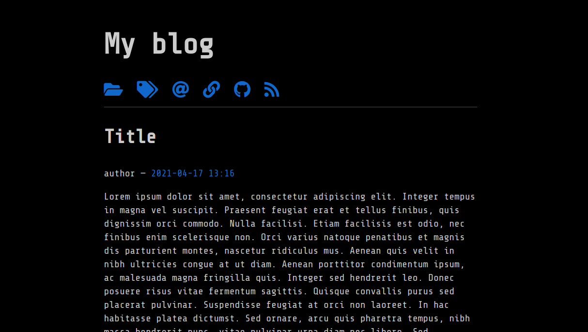

# Nikola-Hack-theme-fontawesome
A nerdy NIkola theme, based on HACK CSS now with Font Awesome!

---------
# Sample config

    THEME = "hack"
    GLOBAL_CONTEXT['HACK_VARIANT'] = 'dark'

    NAVIGATION_LINKS = {
        DEFAULT_LANG: (
            ('/archive.html', 'Archives', 'fa fa-folder-open'),
            ('/categories/index.html', 'Tags', 'fa fa-tags'),
            ('/pages/contact/', 'Contact', 'fa fa-at'),
            ('/pages/links/', 'Links', 'fa fa-link'),
            ('https://github.com/', 'My Github', 'fab fa-github'),
            ('/rss.xml', 'RSS', 'fa fa-rss'),
        )    
    }

# Screenshot

